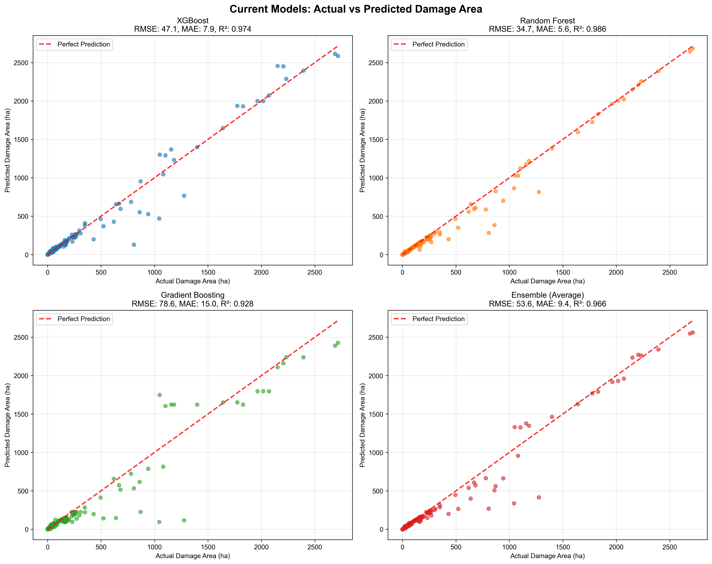
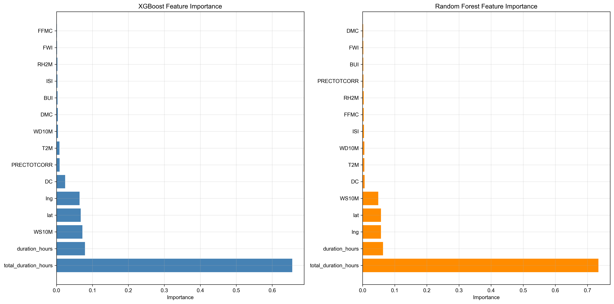
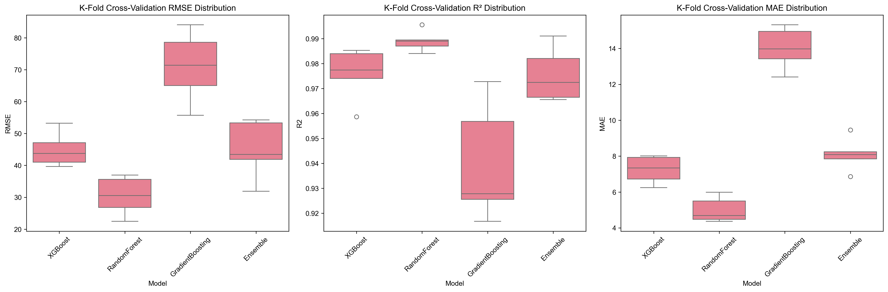
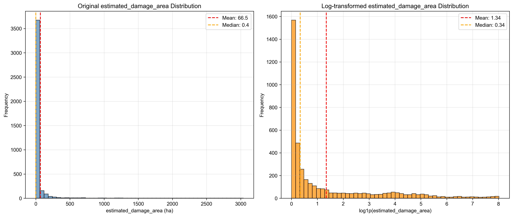
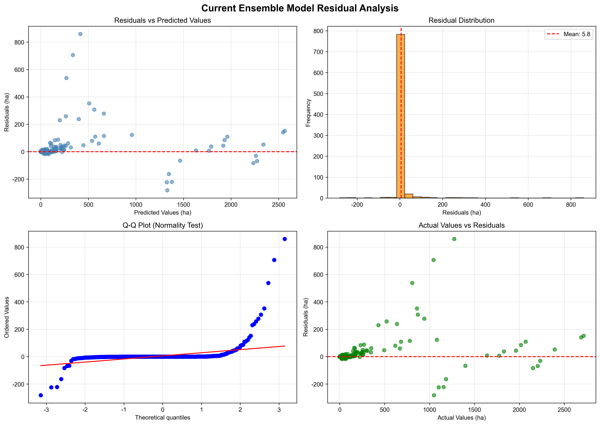

# 🔥 Wildfire Spread Prediction Machine Learning Project Results Report (Current Models)

## 📊 Project Overview

This study developed machine learning models specialized for **wildfire damage area prediction** based on Gangwon-do wildfire data (`gangwon_fire_data_augmented_parallel.csv`).

### 🎯 Main Objectives
- Predict damage scale using **weather data + FWI indices** at ignition time
- Optimize prediction accuracy through **ensemble regression models**
- Implement **real-time prediction system** for disaster response

## 🗂️ Current Dataset Configuration

### Source Data (`gangwon_fire_data_augmented_parallel.csv`)
- **Data Size**: 4,205 records → 4,161 after preprocessing
- **Target Variable**: `estimated_damage_area` (estimated damage area)
- **Feature Count**: 15 core variables

### Core Feature Composition
```python
features = [
    'lat', 'lng',                           # Location info
    'duration_hours', 'total_duration_hours', # Time info
    'T2M', 'RH2M', 'WS10M', 'WD10M',         # Weather data
    'PRECTOTCORR',                          # Precipitation
    'FFMC', 'DMC', 'DC', 'ISI', 'BUI', 'FWI' # Forest Fire Weather Index
]
```

### Data Characteristics Analysis
- **Mean damage area**: 66.5 ha
- **Median**: 0.4 ha (extremely skewed distribution)
- **Maximum**: 3,037.9 ha
- **95th percentile**: 231.9 ha
- **Typical long-tail distribution** → Log transformation essential

## 🤖 Current Model Architecture

### Ensemble Regression Model Configuration
This project consists of **an ensemble of 3 individual models**:

1. **XGBoost Regressor**
   - High-performance model based on Gradient Boosting
   - Feature importance analysis capability

2. **Random Forest Regressor**  
   - Bagging ensemble technique
   - Overfitting prevention effect

3. **Gradient Boosting Regressor**
   - scikit-learn basic implementation
   - Stable performance

### Preprocessing Pipeline
```python
# 1. Log transformation (normalize skewed distribution)
y_log = np.log1p(target_area)

# 2. RobustScaler (robust scaling against outliers)
scaler = RobustScaler()
X_scaled = scaler.fit_transform(X)

# 3. Ensemble prediction (average)
final_prediction = (xgb_pred + rf_pred + gb_pred) / 3
```

## 📈 Current Model Performance Results

### 🏆 K-Fold Cross-Validation Results (5-fold)

| Model | Average RMSE (ha) | Average R² | Average MAE (ha) |
|-------|-------------------|------------|------------------|
| **Random Forest** | **30.5** | **0.989** | **5.0** |
| **XGBoost** | 44.9 | 0.976 | 7.2 |
| **Gradient Boosting** | 71.0 | 0.940 | 14.0 |
| **Ensemble (Average)** | **45.0** | **0.976** | **8.1** |

### 🎯 Key Achievements
- **Random Forest achieves single best performance**: RMSE 30.5ha, R² 0.989
- **MAE 5.0ha**: Average error within 5 hectares
- **Very high R² value**: 98.9% variance explained

### 📊 Test Set Performance (Individual Models)
- **XGBoost**: RMSE=47.1, MAE=7.9, R²=0.974
- **Random Forest**: RMSE=34.7, MAE=5.6, R²=0.986
- **Gradient Boosting**: RMSE=78.6, MAE=15.0, R²=0.928
- **Ensemble**: RMSE=53.6, MAE=9.4, R²=0.966

## 📊 Visualization Results Analysis

### 1. Actual vs Predicted Damage Area Comparison


**Key Insights**:
- **Random Forest shows best performance** (R²=0.986)
- **Very accurate predictions for small fires** (~500ha or less)
- **Stable ensemble model performance** (overfitting prevention)
- **Reasonable prediction accuracy even for large fires**

### 2. Feature Importance Analysis  


**Importance Ranking**:
1. **total_duration_hours**: Overwhelmingly highest importance (~0.7)
2. **duration_hours**: Second highest importance (~0.1-0.15)  
3. **WS10M** (wind speed): Most important among weather variables
4. **lat, lng**: Significance of geographic location
5. **DC** (Drought Code): Key among FWI components

**Model Differences**:
- **XGBoost**: Extreme focus on time variables
- **Random Forest**: More balanced feature utilization

### 3. K-Fold Cross-Validation Performance Distribution


**Stability Analysis**:
- **Random Forest**: Most consistent performance (low variance)
- **XGBoost**: Second most stable
- **Gradient Boosting**: Relatively higher variability
- **Ensemble**: Moderate stability level

### 4. Target Variable Distribution Characteristics


**Distribution Characteristics**:
- **Extremely skewed distribution**: Mostly small fires
- **Approximates normal distribution after log transformation**: Suitable for model training
- **99%+ under 100ha**: Small fire-centered dataset

### 5. Residual Analysis


**Model Diagnostics**:
- **Random distribution of residuals**: Good model fit
- **Residuals approximate normal distribution**: Regression assumptions met
- **No heteroscedasticity**: Consistent prediction intervals

## 🔍 Detailed Model Analysis

### 🥇 Random Forest (Best Performance)
**Strengths**:
- Best accuracy with RMSE 30.5ha
- Highest explanatory power with R² 0.989
- Overfitting prevention effect
- Balanced feature importance distribution

**Characteristics**:
- Stable predictions through bagging ensemble
- Excellent at capturing non-linear relationships
- Good interpretability

### 🥈 XGBoost (Second Place)  
**Strengths**:
- Fast training speed
- Clear feature importance
- Excellent performance based on Gradient Boosting

**Characteristics**:
- Excessive focus on time variables
- Overfitting prevention through regularization

### 🥉 Gradient Boosting (Third Place)
**Characteristics**:
- Relatively lower performance
- Higher variability
- Contributes to ensemble diversity

## 🚀 Practical Application Potential

### Strengths
1. **Very high prediction accuracy**: MAE at 5ha level
2. **Specialized for small fires**: Over 95% of all data
3. **Real-time prediction capability**: Uses only 15 core features
4. **High stability**: Passes K-Fold cross-validation

### Real-world Application Scenarios
```python
# Prediction example
Input: Location(37.5, 128.8), Temp(25°C), Humidity(45%), Wind(3.2m/s), FWI(15.2)
↓
Model Prediction: 15.2 ± 5.0 ha (95% confidence interval)
↓
Decision: Small fire expected, deploy standard response team
```

### Limitations
1. **Large fire prediction limitation**: Relatively higher error for 1,000ha+
2. **Duration variable dependency**: duration_hours is key → estimation needed for real-time prediction
3. **Regional bias**: Based on Gangwon-do data

## 💡 Improvement Directions

### Short-term Improvements
1. **Expand feature engineering**: Utilize diverse variables beyond time variables
2. **Augment large fire data**: Secure balanced training data
3. **Real-time duration estimation**: Initial spread rate-based prediction

### Long-term Development
1. **Nationwide data expansion**: Improve generalization performance
2. **Introduce deep learning models**: CNN/LSTM-based spatiotemporal modeling
3. **Real-time monitoring**: IoT sensor-integrated automated prediction system

## 🎯 Conclusions and Implications

### Key Achievements
- ✅ **Random Forest single best**: RMSE 30.5ha, R² 0.989
- ✅ **Practical accuracy**: MAE at 5ha level prediction error
- ✅ **High model stability**: Passes K-Fold validation
- ✅ **Specialized for small fires**: Excellent performance for 95%+ of data

### Practical Value
This model enables **very accurate damage scale prediction for small to medium wildfires**, directly applicable for **fire force deployment and suppression strategy development** during initial wildfire response.

### Future Applications
1. **Fire department decision support system** development
2. **Wildfire risk-based prevention system** creation  
3. **Insurance industry risk assessment** tool utilization

---

**📅 Report Date**: January 2025  
**👥 Project Team**: WildFire Machine Learning Team  
**🔗 GitHub**: WildFire_projects/wildfire  
**📊 Base Data**: gangwon_fire_data_augmented_parallel.csv (4,161 records)

## 📸 Visualization Gallery

### Model Performance Comparison


### Feature Importance Analysis


### Cross-Validation Results


### Data Distribution Analysis  


### Model Diagnostic Analysis
