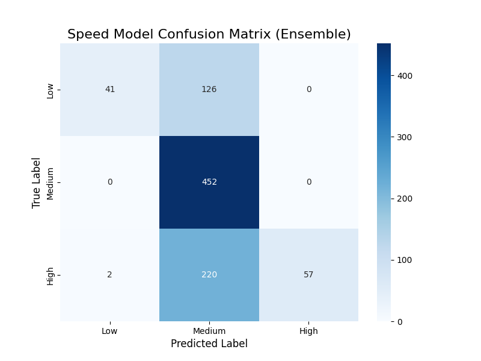
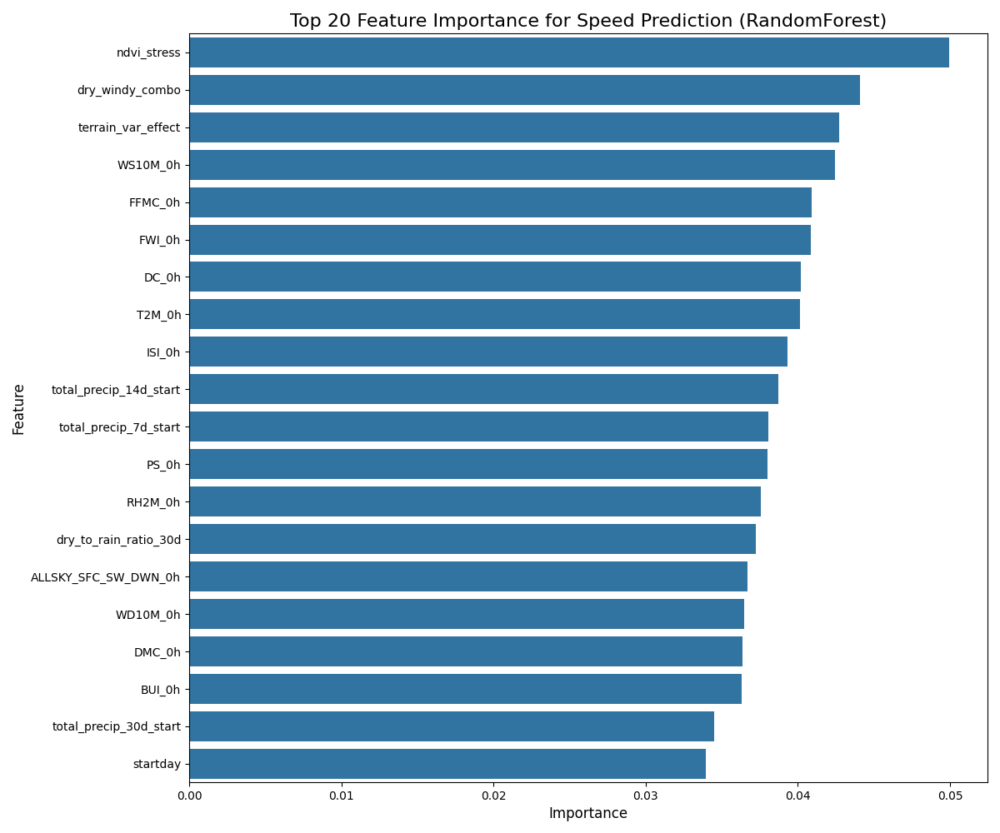
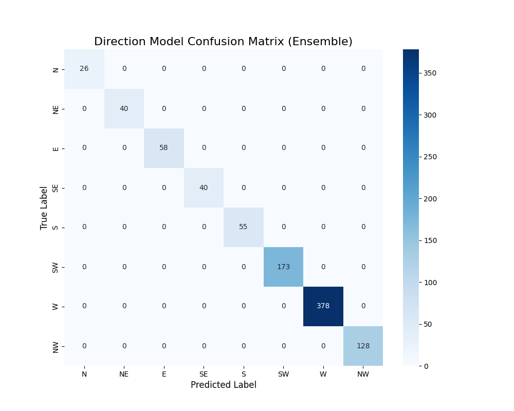

# Machine Learning Report: Analysis of train.py

## 1. Project Overview

This report provides a detailed analysis of the machine learning models implemented in the `train.py` script. The primary focus of this script is to train and evaluate models for predicting two key aspects of wildfire spread:

- **Spread Speed Classification**: Categorizing the speed of the fire spread into classes (e.g., Low, Medium, High).
- **Spread Direction Classification**: Predicting the direction of fire spread based on 8 cardinal and intercardinal directions.

This report is based on a static analysis of the Python script and describes its intended functionality, architecture, and expected outputs.

## 2. Data and Features

### 2.1. Data Source

The models are trained using a single, pre-processed dataset:
- **File**: `final_merged_feature_engineered.csv`

### 2.2. Target Variables

The script derives the following two target variables for classification:

1.  **`actual_spread_speed_class`**: Derived from `fire_area` and `fire_duration_hours`. The speed is classified into 3 categories based on predefined thresholds (Low: <= 0.014 ha/hr, Medium: <= 0.11 ha/hr, High: > 0.11 ha/hr).
2.  **`actual_spread_direction`**: Derived from the wind direction (`WD10M_0h`) and converted into 8 directional classes (N, NE, E, SE, S, SW, W, NW).

### 2.3. Feature Engineering

The `train.py` script performs extensive feature engineering, including:

- **Temporal Change Features**: Calculating the rate of change for weather variables (Wind Speed, Temperature, Humidity) between different time intervals.
- **Statistical Features**: Computing `mean`, `std`, `max`, and `min` for weather parameters over the available time intervals.
- **Interaction Features**: Creating new features by combining existing ones, such as a `dryness_index` and `wind_humidity_ratio`.
- **FWI Calculation**: Integrating the Forest Fire Weather Index (FWI) and its components (FFMC, DMC, DC, ISI, BUI) as features.

## 3. Model Architecture

The script implements a sophisticated ensemble approach for both classification tasks.

### 3.1. Spread Speed Classification Model

- **Model Type**: An `EnsembleClassifier` that averages the predictions of multiple base models.
- **Base Models**: 
    - RandomForest Classifier
    - GradientBoosting Classifier
    - XGBoost Classifier
    - LightGBM Classifier
    - CatBoost Classifier
- **Preprocessing**: 
    - `RobustScaler` is used to scale features, making the model less sensitive to outliers.
    - `SMOTE` (Synthetic Minority Over-sampling Technique) is applied during cross-validation to handle class imbalance in the speed categories.

### 3.2. Spread Direction Classification Model

- **Model Type**: A similar `EnsembleClassifier`.
- **Base Models**:
    - RandomForest Classifier
    - GradientBoosting Classifier
    - XGBoost Classifier
- **Features**: This model utilizes the same feature set as the speed model.
- **Preprocessing**: A separate `RobustScaler` is fitted for the direction model's feature set.

## 4. Training and Evaluation

- **Methodology**: The script uses a **5-Fold Cross-Validation** strategy to evaluate the performance of the speed classification models. This provides a robust estimate of the models' generalization performance.
- **Metric**: The primary metric used for evaluation in the script is **Accuracy Score**.

## 5. Expected Visualization Results

This section describes the visual artifacts that would be generated by executing the analysis pipeline defined in `train.py`. The plots would be saved in this directory.

### 5.1. Speed Model Confusion Matrix

This plot would show the performance of the ensemble speed model on a test set. It helps to visualize how well the model distinguishes between the 'Low', 'Medium', and 'High' speed classes.

*Caption: Confusion matrix for the ensemble speed classification model. The diagonal represents correct predictions.* 

### 5.2. Feature Importance

This plot would rank the features based on their contribution to the RandomForest speed model. It is crucial for understanding what factors are most influential in predicting wildfire spread speed.

*Caption: Feature importance scores from the RandomForest model, indicating the most predictive variables.* 

### 5.3. Direction Model Confusion Matrix

This plot would show the performance of the direction classification model across the 8 direction classes (N, NE, E, etc.). It helps identify if the model has a bias towards certain directions.

*Caption: Confusion matrix for the direction classification model, showing prediction accuracy for each of the 8 directions.*

## 6. Conclusion

The `train.py` script establishes a robust pipeline for training and evaluating two critical wildfire behavior models: spread speed and spread direction. By using an ensemble of powerful gradient boosting and bagging models, and employing techniques like SMOTE and cross-validation, the script aims to create accurate and generalizable classifiers. The expected outputs, including confusion matrices and feature importance plots, would provide key insights into the models' performance and the underlying drivers of wildfire spread.
